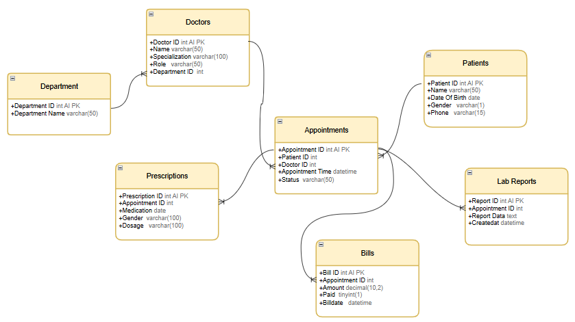
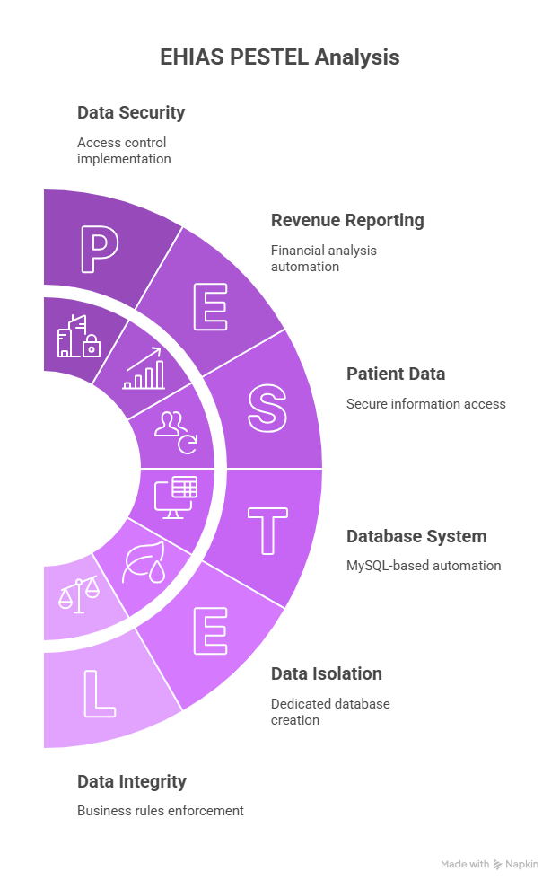

# 🏥 EHIAS – Enterprise Hospital Information Automation System

## 📌 Project Overview
EHIAS is a **MySQL-based hospital database system** designed to migrate a legacy **Excel-based hospital record system** into a **structured, secure, and automated relational database**.  
The project focuses on enforcing **data integrity, business rules, access control, and reporting automation** directly at the database level.

--------
## 🎯 Problem Statement

**Background:**
Our hospital has been maintaining all its records — including patient details, doctor rosters, appointments, prescriptions, lab reports, and billing — using Excel files. As operations scaled, this method became inefficient, error-prone, and difficult to manage. We are transitioning to a relational database system to improve data integrity, performance, and scalability.

**Problem Description:**
Build a robust, well-structured relational database that captures core hospital functionality and migrates data from the current Excel-based system into the new database. The migration must ensure data integrity and consistency. The database should also enforce business rules for appointment management, doctor access control, and generation of department-wise revenue reports.

Problems that were resloved with this Database Design are:
1. Lack of Unique Identifiers
    - Current Excel sheets contain no guaranteed unique IDs for patients, doctors, departments, or appointments.
    - Solution: introduce `AUTO_INCREMENT` primary keys and proper unique constraints to guarantee uniqueness.
2. Disconnected Relationships
    - Appointments exist in spreadsheets but are not enforceably linked to valid patients or doctors.
    - Solution: use foreign keys to enforce referential integrity between `Patients`, `Doctors`, `Departments`, and `Appointments`.
3. Invalid or Ambiguous Data Entries
    - Examples: gender values like "X", appointment statuses like "On Hold", and inconsistent date formats.
    - Solution: enforce domain constraints and CHECK rules (e.g., Gender must be `M`, `F`, or `O`; Status must be `Scheduled`, `Completed`, or `Cancelled`), plus migration scripts to normalize formats.

4. Unregulated Scheduling
    - Doctors are sometimes double-booked and appointments are created in the past.
    - Solution: implement `BEFORE INSERT` triggers that validate appointment times (prevent past dates) and detect double-booking for the same doctor/time slot.
5. Open Access to Sensitive Patient Information
    - All doctors currently see all patient data regardless of role or department.
    - Solution: implement role-based access using stored procedures that check credentials and return either department-wide data for senior doctors or only per-doctor patients for others.
6. Disconnected Reporting
    - No way to generate billing or departmental summaries across the hospital.
    - Solution: stored procedures that aggregate billing data (e.g., monthly revenue by department) and produce management-ready reports.

### How the SQL solves each problem
- Problem 1: `AUTO_INCREMENT` primary keys and `UNIQUE` constraints are included in the DDL inside [Hospital_Database_Creation.sql](Hospital_Database_Creation.sql).
- Problem 2: Foreign key definitions in the table DDL enforce referential integrity; see the `FOREIGN KEY` clauses in the same script.
- Problem 3: `CHECK` constraints and data-normalization `INSERT ... SELECT STR_TO_DATE(...)` migration statements are included in the migration section of [Hospital_Database_Creation.sql](Hospital_Database_Creation.sql).
- Problem 4: The trigger `Check_New_Appointment` (shown below and present in `Hospital_Database_Creation.sql`) prevents past appointments and double-booking:

```
CREATE TRIGGER Check_New_Appointment
BEFORE INSERT ON Appointments
FOR EACH ROW
BEGIN
    IF NEW.Appointmenttime < NOW() THEN
        SIGNAL SQLSTATE '45000' SET MESSAGE_TEXT = 'Appointment cannot be in the past';
    END IF;

    IF EXISTS (
        SELECT 1 FROM Appointments
        WHERE Doctorid = NEW.Doctorid
        AND Appointmenttime = NEW.Appointmenttime
        AND Status = 'Scheduled'
    ) THEN
        SIGNAL SQLSTATE '45000' SET MESSAGE_TEXT = 'Doctor already has an appointment at this time';
    END IF;
END;
```

- Problem 5: The stored procedure `VIEW_DOCTOR_DATA` (also in `Hospital_Database_Creation.sql`) enforces role-based access:

```
CREATE PROCEDURE VIEW_DOCTOR_DATA (
    IN INPUT_USERNAME VARCHAR(100),
    IN INPUT_PASSWORD VARCHAR(100)
)
BEGIN
    -- authenticate and load role/department, then return rows based on role
END;
```

- Problem 6: The stored procedure `SP_MONTHLY_REVENUE` aggregates billing by department and accepts `P_YEAR` and `P_MONTH` as inputs; it is included in `Hospital_Database_Creation.sql`.

For full SQL code, see [Hospital_Database_Creation.sql](Hospital_Database_Creation.sql) in this repository; the script includes the DDL, triggers, stored procedures, and example migration statements referenced above.

All critical rules are enforced **at the database level** using **constraints, triggers, and stored procedures**.

### Included SQL Scripts (in this repository)
- [Hospital_Database_Creation.sql](Hospital_Database_Creation.sql): contains DDL to create schema (tables, keys, CHECK constraints), triggers for appointment validation and other business rules, stored procedures for role-based access and revenue reporting, and migration SQL used to import the legacy Excel/staging data.
- `dataset/`: contains CSVs used for migration and testing, for example `dataset/hospital_data_10000_rows.csv` and `dataset/doctor_credentials.csv`.

Use the SQL script `Hospital_Database_Creation.sql` to recreate the database and to review the triggers and stored procedures that solve the problems described above.

----------
## ✅ Solution Summary
This project replaces Excel with a **normalized relational database (3NF)** using MySQL and solves the above issues through:
- Primary & foreign keys
- CHECK constraints
- Triggers for validation
- Stored procedures for automation and security

-------------

## 🧱 Database Creation
The system models core hospital operations using the following entities:
- Departments  
- Doctors  
- Patients  
- Appointments  
- Prescriptions  
- Lab Reports  
- Bills 

## EHIAS Database ER Diagram



### **Key Design Choices**
- `AUTO_INCREMENT` primary keys for uniqueness
- Foreign keys to enforce referential integrity
- Domain constraints to prevent invalid data

--------
```sql
CREATE DATABASE EHIAS;
USE EHIAS;
```
## Purpose:
- Creates a dedicated database to isolate hospital data and ensure maintainability.

------

## 🏢 Departments Table
```
CREATE TABLE Departments (
    Departmentid INT AUTO_INCREMENT PRIMARY KEY,
    Name VARCHAR(50) NOT NULL
);
```
### Why this design?
- AUTO_INCREMENT ensures unique department identifiers.
- Departments act as a parent entity for doctors and revenue reporting.

---------
## 👨‍⚕️ Doctors Table
```
CREATE TABLE Doctors (
    Doctorid INT AUTO_INCREMENT PRIMARY KEY,
    Name VARCHAR(50),
    Specialization VARCHAR(100),
    Role VARCHAR(50),
    Departmentid INT,
    FOREIGN KEY (Departmentid) REFERENCES Departments(Departmentid)
);
```
### Key Points:
- Each doctor belongs to a department.
- Role is later used for access control in stored procedures.
- Foreign key enforces valid department mapping.

---------
## 🧑‍🦱 Patients Table
```
CREATE TABLE Patients (
    Patientid INT AUTO_INCREMENT PRIMARY KEY,
    Name VARCHAR(50),
    DateofBirth DATE,
    Gender VARCHAR(1),
    Phone VARCHAR(15),
    CHECK (Gender IN ('m','f','o'))
);
```
### Business Rules Enforced:
- Gender values restricted to valid options only ("M" or "F" or others as "o")
- Prevents ambiguous entries like 'X' or 'Malee'.

----------
## 📅 Appointments Table
```
CREATE TABLE Appointments (
    Appointmentid INT AUTO_INCREMENT PRIMARY KEY,
    Patientid INT,
    Doctorid INT,
    Appointmenttime DATETIME,
    Status VARCHAR(50),
    FOREIGN KEY (Patientid) REFERENCES Patients(Patientid),
    FOREIGN KEY (Doctorid) REFERENCES Doctors(Doctorid),
    CHECK (Status IN ('Scheduled','Completed','Cancelled'))
);
```

### Why this matters:
- Links patients and doctors using foreign keys.
- Appointment status strictly controlled.
- Foundation for billing, prescriptions, and lab reports.
--------

## 💊 Prescriptions Table
```
CREATE TABLE Prescriptions (
    Prescriptionid INT AUTO_INCREMENT PRIMARY KEY,
    Appointmentid INT,
    Medication VARCHAR(100),
    Dosage VARCHAR(100),
    FOREIGN KEY (Appointmentid) REFERENCES Appointments(Appointmentid)
);
```
### Purpose:
- Prescriptions tied directly to appointments.
- Prevents orphan medical records.
---------

## 🧾 Bills Table
```
CREATE TABLE Bills (
    Billid INT AUTO_INCREMENT PRIMARY KEY,
    Appointmentid INT,
    Amount DECIMAL(10,2),
    Paid TINYINT(1),
    Billdate DATETIME DEFAULT CURRENT_TIMESTAMP,
    FOREIGN KEY (Appointmentid) REFERENCES Appointments(Appointmentid)
);
```
### Why this design?
- Enables financial tracking per appointment.
- Supports revenue aggregation by department.

------------

## 🧪 Lab Reports Table
```
CREATE TABLE LabReports (
    Reportid INT AUTO_INCREMENT PRIMARY KEY,
    Appointmentid INT,
    Reportdata TEXT,
    Createdat DATETIME DEFAULT CURRENT_TIMESTAMP,
    FOREIGN KEY (Appointmentid) REFERENCES Appointments(Appointmentid)
);
```
### Purpose:
- Stores diagnostic results.
- Maintains strict linkage to appointments.

-----------

### 📦 Data Migration Strategy
- Legacy Excel data was imported into a staging table called hospital_data.
```
INSERT INTO Patients (Patientid, Name, DateofBirth, Gender, Phone)
SELECT 
    `Patients.PatientID`,
    `Patients.Name`,
    STR_TO_DATE(`Patients.DateofBirth`, '%d-%m-%Y'),
    `Patients.Gender`,
    `Patients.Phone`
FROM hospital_data
WHERE `Patients.PatientID` <> '';
```
### What this achieves:
- Standardizes inconsistent date formats.
- Filters invalid rows.
- Migrates clean data only.

----

## ⚙️ Trigger: Appointment Validation
```
CREATE TRIGGER Check_New_Appointment
BEFORE INSERT ON Appointments
FOR EACH ROW
BEGIN
    IF NEW.Appointmenttime < NOW() THEN
        SIGNAL SQLSTATE '45000'
        SET MESSAGE_TEXT = 'Appointment cannot be in the past';
    END IF;

    IF EXISTS (
        SELECT 1 FROM Appointments
        WHERE Doctorid = NEW.Doctorid
        AND Appointmenttime = NEW.Appointmenttime
        AND Status = 'Scheduled'
    ) THEN
        SIGNAL SQLSTATE '45000'
        SET MESSAGE_TEXT = 'Doctor already has an appointment at this time';
    END IF;
END;
```
### Business Rules Enforced Automatically:
### Appointment Validation Trigger
A `BEFORE INSERT` trigger on appointments ensures:
- Appointments cannot be scheduled in the past
- Doctors cannot be double-booked for the same time slot

**Result:**  
Prevents invalid scheduling and enforces real-world hospital rules automatically.

---------

## 🔐 Stored Procedure: Role-Based Doctor Access
```
CREATE PROCEDURE VIEW_DOCTOR_DATA (
    IN INPUT_USERNAME VARCHAR(100),
    IN INPUT_PASSWORD VARCHAR(100)
)
BEGIN
    DECLARE DOC_ROLE VARCHAR(50);
    DECLARE DOC_DEPT INT;
    DECLARE DOC_ID INT;

    SELECT Doctor_id INTO DOC_ID
    FROM Doctor_Credentials
    WHERE User_Name = INPUT_USERNAME
    AND Password = INPUT_PASSWORD;

    SELECT Role, Departmentid
    INTO DOC_ROLE, DOC_DEPT
    FROM Doctors
    WHERE Doctorid = DOC_ID;

    IF DOC_ROLE = 'senior' THEN
        SELECT *
        FROM Patients P
        JOIN Appointments A ON P.Patientid = A.Patientid
        JOIN Doctors D ON A.Doctorid = D.Doctorid
        WHERE D.Departmentid = DOC_DEPT;
    ELSE
        SELECT *
        FROM Patients P
        JOIN Appointments A ON P.Patientid = A.Patientid
        WHERE A.Doctorid = DOC_ID;
    END IF;
END;
```
### Access Logic:
- Senior doctors → Department-wide patient data
- Junior doctors → Own appointments only

### Why stored procedure?
### Role-Based Doctor Data Access
- Authenticates doctors using credentials
- **Senior doctors** can view all patient data within their department
- **Junior doctors** can access only their own appointments

This ensures **secure and controlled access to sensitive patient information**.

---------

## 📊 Stored Procedure: Monthly Revenue Report
```
CREATE PROCEDURE SP_MONTHLY_REVENUE (
    IN P_YEAR INT,
    IN P_MONTH INT
)
BEGIN
    SELECT 
        D.Name AS Department,
        SUM(B.Amount) AS Total_Revenue
    FROM Bills B
    JOIN Appointments A ON B.Appointmentid = A.Appointmentid
    JOIN Doctors DR ON A.Doctorid = DR.Doctorid
    JOIN Departments D ON DR.Departmentid = D.Departmentid
    WHERE MONTH(B.Billdate) = P_MONTH
    AND YEAR(B.Billdate) = P_YEAR
    GROUP BY D.Name;
END;
```
### Monthly Department Revenue Report
- Generates department-wise revenue
- Accepts year and month as input parameters
- Aggregates billing data automatically

Used for **management reporting and financial analysis**.

-------

## 🚀 Key Outcomes
- Migrated Excel-based hospital data into a **production-ready MySQL database**
- Enforced business rules using triggers and constraints.
- Eliminated invalid and inconsistent records.
- Automated appointment validation and reporting.
- Implemented database-level security and access control.
- Improved data accuracy, scalability, and reliability.

## EHIAS PESTEL Analysis


------

## 🛠️ Technologies Used
- MySQL
- SQL (DDL, DML)
- Triggers
- Stored Procedures
- Relational Database Design (3NF)

------

## 📄 Author
Harddik Singh
SQL • Data Analytics • Hospital Database Design

-------


